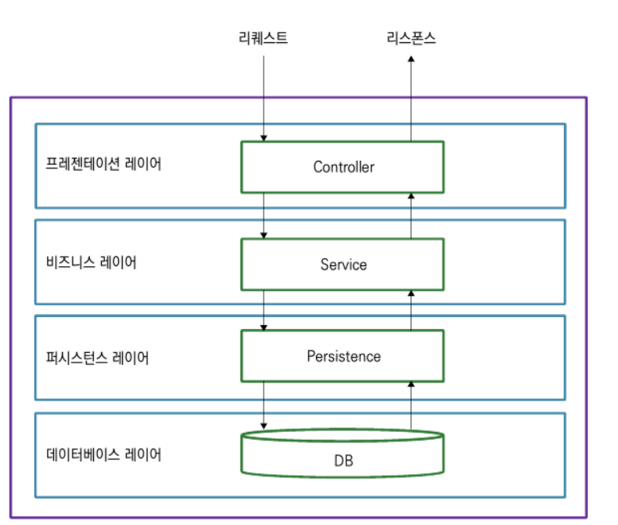

# java-springboot-react-webAppTodo 
Simple application showing todo lists with the following features :  
- JPA
- React (for frontend)
- Security and JWT

### 1. Layered Archtecture  
- Presentation layer
- Business layer
- Persistance(Repository) layer
- DB layer  

  


### 2. DTO, Model, and Entity  
- DTO : object for client sides > Presentational layer  
- Model: object for business logic > Business layer
- Entity: object for handling DB  > Persistence layer  

  


### `Model example`   
Sometimes, one class acts as model, and entity together as below:
```java
@Builder
@NoArgsConstructor
@AllArgsConstructor
@Data
// to act as entity (handling DB)
@Entity
@Table(name = "Todo")
public class TodoEntity {

  @Id
  @GeneratedValue(strategy = GenerationType.UUID)
  private String id;
  private String userId;
  private String title;
  private boolean done;
}
```
### 3. Log (Slf4j)  
Slf4j : Simple Logging Facade for java

```java
@Service
@RequiredArgsConstructor
// lombok anotation
@Slf4j
public class TodoService {

  private final TodoRepository todoRepository;

  public List<TodoEntity> create(final TodoEntity entity) {

    todoRepository.save(entity);
    //log.info("....{} ..", String s);  {} is replaced with s
    log.info("Entity Id : {} is saved.", entity.getId());

    return todoRepository.findByUserId(entity.getUserId());
  }
}
```
### 4. Java 'final' keyword  
- final class : Unable to do inheritance  
- final method : Unable to do overriding
- final variable : act as a constant; unable to change  

### `final argument in method`  
To protect the argument from changing (any unnecessary changes..)
```java
  public List<TodoEntity> create(final TodoEntity entity){

    validateEntity(entity);

    todoRepository.save(entity);
    log.info("Entity Id : {} is saved.", entity.getId());

    return todoRepository.findByUserId(entity.getUserId());
  }
```  
### 5. Spring boot + React integration 1 (general & scalable servers)  

Integration with AWS Elastic Beanstalk
> AWS Elastic Beanstalk  
>> An orchestrataion service offered by Amazon Web Services for deploying application which orchestrates various AWS services, including EC2, S3, Simple Notification Serivce, CloudWatch, autoscaling, and Elastic Load Balanceers  

In this case,  
- To develop separate project : frontend(React) and Backend(Springboot)  
- To resolve CORS issues  

Spring boot and React Service example: 

  


### `CORS`  
> When a webpage makes a request to a different domain, CORS erros happen.  
    React : localhost:3000  
    Spring boot(rest api service): localhost:8080  


CORS issues can be managed with the following setting in backend:
```java
package com.jeff.todo.config;

import org.springframework.context.annotation.Configuration;
import org.springframework.web.servlet.config.annotation.CorsRegistry;
import org.springframework.web.servlet.config.annotation.WebMvcConfigurer;

@Configuration
public class WebMvcConfig implements WebMvcConfigurer {
  private final long MAX_AGE_SECS = 3600;
  @Override
  public void addCorsMappings(CorsRegistry registry) {
  registry.addMapping("/**")
  .allowedOrigins("http://localhost:3000")
  .allowedMethods("GET", "POST", "PUT", "PATCH", "DELETE", "OPTIONS")
  .allowedHeaders("*")
  .allowCredentials(true)
  .maxAge(MAX_AGE_SECS);
  }
}
  ```

### 6. Spring boot + React integration 2 (in a single server)  

If your application is simple and does not require high resources, you may integrate frontend(React) and backend(Backend) in a single server:
### `To Create Spring boot project`  
After creation, test application start.  
> http:localhost:8080  
### `To Create React project`  
```agsl
// To move into spring boot project's src/main
cd src/main  

// To create react app with the name 'frontend'
npm create-react-app ./frontend  

// To move into the frontend 
cd frontend  
 
// To test react app start
npm start
```  

### `Project integration`  
To install http-proxy-middleware  
```agsl
// in the react project root...
npm install http-proxy-middleware
```  
To config proxy setting  

```agsl
// setupProxy.js
// This file should be located right under src folder.
const { createProxyMiddleware } = require("http-proxy-middleware");

module.exports = function (app) {
  app.use(
    "/api",
    createProxyMiddleware({
      target: "http://localhost:8080", // 서버 URL or localhost:portNum
      changeOrigin: true,
    })
  );
};
```  
with the upper setting...  
> if you call "/api" url in React project  
> you would go to "localhost:8080/api"  
```
/               : static server returns index.html with React app  
/todos          : static server returns index.html with React app  
/api/todos      : server handles any /api/* requests using the backend implementation
```

### `Integration Test`
App.js in react project
```agsl
import { useEffect, useState } from "react";
import "./App.css";

function App() {
  const [hello, setHello] = useState("");
  useEffect(() => {
    fetch(`/api/test`)
      .then((res) => res.text())        //res.json(): When getting json data from server 
      .then((res) => setHello(res));
  }, []);

  return <div>Hello React : {hello}</div>;
}
export default App;
```  

Test Controller of spring boot
```agsl
package com.jeff.todo.controller;

@RestController
@RequestMapping("/api/test")
public class TestController {

  @GetMapping
  public String test(){
    return "Server API test....";
  }
}
```  
To test backend side  
```
// After starting spring boot project...  

localhost:8080/api/test
```  
To test frontend side
```
// After starting react project...  

localhost:3000
```

### `Gradle Build Setting`
To add the following script to the bottom of build.gradle file in spring boot
```agsl
def frontendDir = "$projectDir/src/main/frontend"

sourceSets {
	main {
		resources { srcDirs = ["$projectDir/src/main/resources"]
		}
	}
}

processResources { dependsOn "copyReactBuildFiles" }

task installReact(type: Exec) {
	workingDir "$frontendDir"
	inputs.dir "$frontendDir"
	group = BasePlugin.BUILD_GROUP
	if (System.getProperty('os.name').toLowerCase(Locale.ROOT).contains('windows')) {
		commandLine "npm.cmd", "audit", "fix"
		commandLine 'npm.cmd', 'install' }
	else {
		commandLine "npm", "audit", "fix" commandLine 'npm', 'install'
	}
}

task buildReact(type: Exec) {
	dependsOn "installReact"
	workingDir "$frontendDir"
	inputs.dir "$frontendDir"
	group = BasePlugin.BUILD_GROUP
	if (System.getProperty('os.name').toLowerCase(Locale.ROOT).contains('windows')) {
		commandLine "npm.cmd", "run-script", "build"
	} else {
		commandLine "npm", "run-script", "build"
	}
}

task copyReactBuildFiles(type: Copy) {
	dependsOn "buildReact"
	from "$frontendDir/build"
	into "$projectDir/src/main/resources/static"
}
```
When you build with gradle, you may find result jar files in the build/libs folder.  

### `Deployment`  
To deploy the jar file into your web server  
To start the application
  > java -jar ./jarFileName.jar 

To check the result in the following address:  
  > localhost:8080  

### 7. Inner project within outer project : gitignore ?
Outer Project : Spring boot  
Inner Project : React (location in src/main/frontend)  

Gitignore file is in the outer project root.  
After inner project(react) creation, outer gitignore file needs to be modified as below:  
```agsl
###  Add the following script at the end(bottom) of the root gitignore script  

### VS Code with React Project nested ###
# See https://help.github.com/articles/ignoring-files/ for more about ignoring files.

# dependencies
/src/main/frontend/node_modules
/src/main/frontend/.pnp
/src/main/frontend.pnp.js

# testing
/src/main/frontendcoverage

# production
/src/main/frontend/build

# misc
/src/main/frontend/.DS_Store
/src/main/frontend/.env.local
/src/main/frontend/.env.development.local
/src/main/frontend/.env.test.local
/src/main/frontend/.env.production.local

npm-debug.log*
yarn-debug.log*
yarn-error.log*
```  

### 8. React : useState
useState is an <span style="color:red">async function</span>.
```agsl
const Todo = (props) => {
  const [item, setItem] = useState(props.item);
  const editItem = props.editItem;
 
  const editEventHandler = (e) => {  
  
    // useState is an async function; 
    setItem({ ...item, title: e.target.value });  
    
    // Therefore, below editItem(item) does not wait for finishing setItem(~~) function.
    // Consequently, 'item' value is just reserved one before chaning by upper setItem()
    editItem(item);
  };
  }
```  
To use updated 'item' value...  
- use useEffect hook or   
- call 'item' in other function : the 'item' value must be already updated by upper function(editEventHandler)  

### 9. Javascript: How to change one of the objects inside an array  
arr.map()
```agsl
function App() {
  const [items, setItems] = useState([
    {
      id: "0",
      title: "Spring boot",
      done: true,
    },
    {
      id: "1",
      title: "React",
      done: true,
    },
  ]);

  const editItem = (item) => {
     setItems([
       ...items.map((e) =>
         e.id === item.id ? { ...e, title: item.title, done: item.done } : e
       ),
     ]);
  };
}
```  

### 10. To create utility function with JS fetch()
By creating utility function with JS fetch(), application can be much simple.

### `To create 'api-config.js'`  
if you use 'http-proxy-middleware' (frontend side proxy setting middle-ware), you don't need below file.
```agsl
let backendHost;

const hostname = window && window.location && window.location.hostname;

if (hostname === "localhost") {
  backendHost = "http://localhost:8080";
}

export const API_BASE_URL = `${backendHost}`;

```  
### `To create 'ApiService.js'`

```agsl
import { API_BASE_URL } from "../apiConfig";

export function call(api, method, requestData) {
  let headers = new Headers({
    "Content-Type": "application/json",
  });
  let options = {
    headers: headers,
    url: API_BASE_URL + api,
    method: method,
  };

  if (requestData) {
    // To add body(property), and change JSON to stringify
    options.body = JSON.stringify(requestData);
  }
  return fetch(options.url, options)
    .then((res) => {
      if (res.status === 200) {
        return res.json();
      }
    })
    .catch((err) => {
      console.log("http error!");
      console.log(err);
    });
}


```  

### 11. Axios delete
Unlikely axios.post() and axios.put(), axios.delete() needs the 2nd param with the type : { data : {}}.   

To send a request body with a DELETE request, you should use the <span style="color:red">data</span> option.  
```agsl
const res = await axios.delete('https://httpbin.org/delete', { data: { answer: 42 } });

res.data.json; // { answer: 42 }
```

### 12. Authentication & Authorization  
### `Authentication vs Authorization`  
> Authentication  
> > Matter of login  
> > Who are you?  

> Authorization  
> > Matter of doable  
> > Are you the store worker? Then, you may access to the storage.  

### `Authentication`  
- Basic Auth  
  Adding base64 base encoded string(id/pwd) to every http requests
  > [problems]  
  	Logout issue(No login action; every request is only for login)  
  	Security issue(Handling with id/pwd)  
  	Scaling issue (Every request need every auth; causing server overload)  

- Token base Auth  
  The server reply the encoded token when receiving the first login(with id/pwd) request from client; after then, only the token is attached to every request from the same client.  
  Security issue is resolved.  
  > [problems]  
    Scaling issue (Every request need every auth; causing server overload)  
    (The same way as Auth with session)
- JWT(Json Web Token)  
  Security and scaling issues can be resolved by useing digital signature JWT(Json Web Token)  
  Token contents : header, payload, signature  

### 13 Spring Security with JWT  

### `13.1 To Setup User Authentication Layer`  
To create files : UserEntity, UserRepository, UserService, and UserDTO/UserController

```agsl
// UserEntity =========================  
package com.jeff.todo.model;

@Data @NoArgsConstructor @AllArgsConstructor @Builder @Entity
@Table(uniqueConstraints = {@UniqueConstraint(columnNames = "username")})

public class UserEntity {
  @Id
  @GeneratedValue(strategy = GenerationType.UUID)
  private String id;
  private String username;
  private String password;
  private String role;          // for user,admin
  private String authProvider;  // for OAuth such as github
}  

// UserRepository =========================    
package com.jeff.todo.persistence;

@Repository
public interface UserRepository extends JpaRepository<UserEntity, String> {

  UserEntity findByUsername(String username);
  Boolean existsByUsername(String username);

  UserEntity findByUsernameAndPassword(String username, String password);
}  

// UserService =========================    
package com.jeff.todo.service;

@Service @RequiredArgsConstructor @Slf4j
public class UserService {

  private final UserRepository userRepository;

  public UserEntity create(final UserEntity userEntity){
    if(userEntity == null || userEntity.getUsername() == null){
      throw new RuntimeException("Invalid arguments");
    }
    final String username = userEntity.getUsername();
    if(userRepository.existsByUsername(username)){
      log.warn("Username already exists : {}", username);
      throw new RuntimeException("Username already exists");
    }
    return userRepository.save(userEntity);
  }

  public UserEntity getByCredential(final String username, final String password, PasswordEncoder encoder){
    final UserEntity originalUser = userRepository.findByUsername(username);
    if(originalUser != null &&
    encoder.matches(password, originalUser.getPassword())){
      return originalUser;
    }
    return null;
  }
}

// UserDTO =========================   
package com.jeff.todo.dto;

@Data @NoArgsConstructor @AllArgsConstructor @Builder
public class UserDTO {
  private String token;
  private String username;
  private String password;
  private String id;
}

// UserController =========================  
package com.jeff.todo.controller;

@RestController @RequiredArgsConstructor @Slf4j
@RequestMapping("/todo-api/auth")
public class UserController {

  private final UserService userService;
  private final TokenProvider tokenProvider;
  // Why not...
  //@RequireArgsConstructor can apply only under the com.jeff.todo classes.....
  // private final BcryptPasswordEncoder encoder;
  PasswordEncoder encoder = new BCryptPasswordEncoder();

  @PostMapping("/signup")
  public ResponseEntity<?> registerUser(@RequestBody UserDTO userDTO){
    try {
      if(userDTO == null || userDTO.getPassword() == null){
        throw new RuntimeException("Invalid Password");
      }
      UserEntity userEntity = UserEntity.builder()
          .username(userDTO.getUsername())
          .password(encoder.encode(userDTO.getPassword()))
          .build();
      UserEntity registeredUser = userService.create(userEntity);
      UserDTO responseUserDTO = UserDTO.builder()
          .id(registeredUser.getId())
          .username(registeredUser.getUsername())
          .build();
      return ResponseEntity.ok().body(responseUserDTO);
    } catch (RuntimeException e) {
      ResponseDTO responseDTO = ResponseDTO.builder().error(e.getMessage()).build();
      return ResponseEntity
          .badRequest().body(responseDTO);
    }
  }

  @PostMapping("/signin")
  public ResponseEntity<?> authenticate(@RequestBody UserDTO userDTO){
    UserEntity dbUser = userService.getByCredential(userDTO.getUsername(), userDTO.getPassword(), encoder);
    if(dbUser != null){
      String token = tokenProvider.create(dbUser);
      UserDTO responseUserDTO = UserDTO.builder()
          .username(dbUser.getUsername())
          .id(dbUser.getId())
          .token(token)
          .build();
      return ResponseEntity.ok().body(responseUserDTO);
    }else{
      ResponseDTO responseDTO = ResponseDTO.builder()
          .error("Login Failure")
          .build();
      return ResponseEntity.badRequest().body(responseDTO);
    }
  }
}
```  

### `13.2 Dependency Setting`  
```agsl
// To add the following dependencies in 'build.gradle' file  
	 
// Spring Security
implementation 'org.springframework.boot:spring-boot-starter-security'
// https://mvnrepository.com/artifact/io.jsonwebtoken/jjwt-api
implementation group: 'io.jsonwebtoken', name: 'jjwt-api', version: '0.11.5'
// https://mvnrepository.com/artifact/io.jsonwebtoken/jjwt-impl
runtimeOnly 'io.jsonwebtoken:jjwt-impl:0.11.5'
implementation 'io.jsonwebtoken:jjwt-gson:0.11.5'
```  

### `13.3 To Setup Spring Security and JWT`  
To create files : TokenProvider, JwtAuthenticationFilter, WebSecurityConfig, and TodoController(Modification)  
```agsl
// TokenProvider =========================  
package com.jeff.todo.security;

@Service @Slf4j
public class TokenProvider {
  //   private static final String SECRET_KEY = "dlT0mdt1JqD3idg4MlD5odL6wOd7Ndl8dbS9DKrKSkekFakqkTkdKWKCKZkvkXkgkDNflskfKeoGKSalsrNRod";
  /* To use HS512, key(String) size should be at least 512 bits */
  private static final String base64EncodedSecretKey = "dlT0mdt1JqD3idg4MlD5odL6wOd7Ndl8dbS9DKrKSkekFakqkTkdKWKCKZkvkXkgkDNflskfKeoGKSalsrNRod";
  byte[] keyBytes = Decoders.BASE64.decode(base64EncodedSecretKey);
  Key key = Keys.hmacShaKeyFor(keyBytes);

  public String create(UserEntity userEntity) {
    Date expiryDate = Date.from(
        Instant.now()
            .plus(1, ChronoUnit.DAYS)
    );

    /*
    {
      // header
      "alg":"HS512"
    }.
    {
      // payload
      "sub": "",
      "iss": "demo app",
      "iat": 1596597657,
      "exp":1596597657
    }.
    // SECRET_KEY
     */

    return Jwts.builder()
        .signWith(key, SignatureAlgorithm.HS512)
        .setSubject(userEntity.getId())
        .setIssuer("Todo apps")
        .setIssuedAt(new Date())
        .setExpiration(expiryDate)
        .compact();
  }

  public String validateAndGetUserId(String token){

    Claims claims = Jwts.parserBuilder()
        .setSigningKey(key)
        .build()
        .parseClaimsJws(token)
        .getBody();

    return claims.getSubject();
  }
}  

// JwtAuthenticationFilter =========================    
package com.jeff.todo.security;

@Component @Slf4j @RequiredArgsConstructor
public class JwtAuthenticationFilter extends OncePerRequestFilter {

  private final TokenProvider tokenProvider;

  @Override
  protected void doFilterInternal(HttpServletRequest request, HttpServletResponse response, FilterChain filterChain) throws ServletException, IOException {

    try {
      String token = parseBearerToken(request);
      log.info("Filter is running....");

      if (token != null && !token.equalsIgnoreCase("null")) {
        String userId = tokenProvider.validateAndGetUserId(token);
        log.info("Authenticated user ID : " + userId);

        AbstractAuthenticationToken authentication = new UsernamePasswordAuthenticationToken(
            userId, null, AuthorityUtils.NO_AUTHORITIES
        );

        authentication.setDetails(new WebAuthenticationDetailsSource().buildDetails(request));
        SecurityContext securityContext = SecurityContextHolder.createEmptyContext();
        securityContext.setAuthentication(authentication);
        SecurityContextHolder.setContext(securityContext);
      }
    }catch(Exception e){
      log.error("Could not set user authentication in security context", e);
    }
    filterChain.doFilter(request, response);
  }

  private String parseBearerToken(HttpServletRequest request){
    String bearerToken = request.getHeader("Authorization");
    if(StringUtils.hasText(bearerToken) && bearerToken.startsWith("Bearer ")){
      return bearerToken.substring(7);
    }
    return null;
  }
}

// WebSecurityConfig =========================   
package com.jeff.todo.config;

@Configuration @EnableWebSecurity @RequiredArgsConstructor
public class WebSecurityConfig {

  private final JwtAuthenticationFilter jwtAuthenticationFilter;
//  private final long MAX_AGE_SECS = 3600;

  @Bean
  public SecurityFilterChain filterChain(HttpSecurity http) throws Exception {
    http
//        .csrf().disable()
        .csrf(AbstractHttpConfigurer::disable)
//        .httpBasic().disable()
        .httpBasic(AbstractHttpConfigurer::disable)
//    .sessionManagement().sessionCreationPolicy(SessionCreationPolicy.STATELESS)
        .sessionManagement(session -> session.sessionCreationPolicy(SessionCreationPolicy.STATELESS))
//        .and()
//        .antMatchers("/todo_api","/todo_api/auth/**").permitAll()
//        .anyRequest().authenticated();
        .authorizeHttpRequests(
            auth -> auth.requestMatchers("/", "/api/auth/**").permitAll()
//                .requestMatchers("/todo_api/login").permitAll()
//                .requestMatchers("/todo_api/test/**").permitAll()
                .anyRequest().authenticated()
        );

    http
        .addFilterAfter(
            jwtAuthenticationFilter,
            CorsFilter.class
        );

    return http.build();
  }
}

// TodoController (Application Modification) =========================    
// Instread of using tempUserId, we can use userId with @AuthenticationPrincipal(String userId))
package com.jeff.todo.controller;

@RestController @RequiredArgsConstructor @Slf4j
@RequestMapping("/todo-api")
public class TodoController {

  private final TodoService todoService;

  @PostMapping
  public ResponseEntity<?> createTodo(@AuthenticationPrincipal String userId,  @RequestBody TodoDTO dto){

    try {
//      String tempUserId = "temp-userId";
      TodoEntity entity = TodoDTO.toEntity(dto);
      entity.setId(null);
      entity.setUserId(userId);
      List<TodoEntity> todoEntityList = todoService.create(entity);
      ResponseDTO<TodoDTO> responseDTO = getTodoDTOResponseDTO(todoEntityList);

      return ResponseEntity.ok().body(responseDTO);
    } catch (Exception e) {
      ResponseDTO<TodoDTO> responseDTO = ResponseDTO.<TodoDTO>builder().error(e.getMessage()).build();
      return ResponseEntity.badRequest().body(responseDTO);
    }
  }

  private static ResponseDTO<TodoDTO> getTodoDTOResponseDTO(List<TodoEntity> todoEntityList) {
    // To client side, we give DTO
    // Therefore, Entity needs to be converted to DTO
//    List<TodoDTO> todoDTOList = todoEntityList.stream().map(e -> new TodoDTO(e)).toList();
    List<TodoDTO> todoDTOList = todoEntityList.stream().map(TodoDTO::new).toList();

    // To put data into ResponseDTO
    ResponseDTO<TodoDTO> responseDTO = ResponseDTO.<TodoDTO>builder().data(todoDTOList).build();
    return responseDTO;
  }

  @GetMapping
  public ResponseEntity<?> retrieveTodoList(@AuthenticationPrincipal String userId){

//    String tempUserId = "temp-userId";
    List<TodoEntity> todoEntityList = todoService.retrieve(userId);
    ResponseDTO<TodoDTO> responseDTO = getTodoDTOResponseDTO(todoEntityList);
    return ResponseEntity.ok().body(responseDTO);
  }

  @PutMapping
  public ResponseEntity<?> updateTodo(@AuthenticationPrincipal String userId, @RequestBody TodoDTO dto){
//    String tempUserId = "temp-userId";
    TodoEntity entity = TodoDTO.toEntity(dto);
    entity.setUserId(userId);
    List<TodoEntity> todoEntityList = todoService.update(entity);

    ResponseDTO<TodoDTO> responseDTO = getTodoDTOResponseDTO(todoEntityList);
    return ResponseEntity.ok().body(responseDTO);
  }

  @DeleteMapping
  public ResponseEntity<?> deleteTodo(@AuthenticationPrincipal String userId, @RequestBody TodoDTO dto){
    try {
//      String tempUserId = "temp-userId";
      TodoEntity entity = TodoDTO.toEntity(dto);
      entity.setUserId(userId);

      List<TodoEntity> todoEntityList = todoService.delete(entity);
      ResponseDTO<TodoDTO> responseDTO = getTodoDTOResponseDTO(todoEntityList);
      return ResponseEntity.ok().body(responseDTO);
    } catch (Exception e) {
      ResponseDTO<TodoDTO> responseDTO = ResponseDTO.<TodoDTO>builder().error(e.getMessage()).build();
      return ResponseEntity.badRequest().body(responseDTO);
    }
  }
}
```  

### 14 UI Glitches  
React UI Glitches  
- Unnecessary UI display symptom while loading a specific page, or waiting to get information from other server.

How To Solve
### `14.1 To use flag variables`

```agsl
function App() {
  const [items, setItems] = useState([]);
  // flag variables
  const [loading, setLoading] = useState(true);

  const requestOptions = {
    method: "GET",
    headers: { "Content-Type": "application/json" },
  };

  useEffect(() => {
    call("/api/todo", "GET", null).then((res) => {
      setItems(res.data);
      setLoading(false);
    });
  }, []);

  let todoItems = items?.length > 0 && (
    <Paper sx={{ padding: "8px" }}>
      <List>
        {items?.map((item) => (
          <Todo
            item={item}
            key={item.id}
            deleteItem={deleteItem}
            editItem={editItem}
          />
        ))}
      </List>
    </Paper>
  );

  let todoListPage = (
    <StyledDisplayBox>
      <StyledDisplayInnerBox>
        <AddTodo addItem={addItem} />
        {todoItems}
      </StyledDisplayInnerBox>
    </StyledDisplayBox>
  );

  // while loading
  let loadingPage = (
    <Typography
      variant="h4"
      color={"primary.main"}
      sx={{
        margin: "300px auto",
      }}
    >
      on Loanding....
    </Typography>
  );

  let content = todoListPage;

  if (!loading) content = todoListPage;

  return (
    <StyledBox>
      <NavBar />
      {content}
    </StyledBox>
  );
}
export default App;
```  

### `14g.2 To use Optional Chaning Operator(?.)`
[Object?.property]  
Even though the object before the operator "?." is undefined or null, the operator does not return 'error', and just return 'undefined'.

Normally, 'nullObject.property' returns 'error' which would make React UI glitches.
```agsl
  let todoItems = items?.length > 0 && (
    <Paper sx={{ padding: "8px" }}>
      <List>
        {items?.map((item) => (
          <Todo
            item={item}
            key={item.id}
            deleteItem={deleteItem}
            editItem={editItem}
          />
        ))}
      </List>
    </Paper>
  );
```


## Reference

Writer : Dajung Kim  
Book title : Web Development 101 with React.js, Springboot, AWS (2nd Edition)   
Publishing : ACORN Publishing Co.,   
Book source codes : https://github.com/fsoftwareengineer/todo-application-revision2